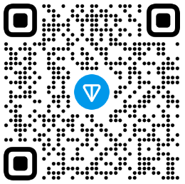
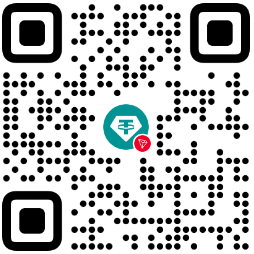

<p align="center">
  <a href="./README.ru.md">
    
  </a>
  <a href="./README.md">
    
  </a>
</p>

<p align="center">
  
  
  
  <a href="https://discord.gg/V88YGcXhMm">
    
  </a>
  
</p>

---

# Syndrome Team

**Syndrome Team** is an open organization focused on creating useful and free tools.  
Currently, our key project is **CollectDB** — an app for collectors to store and organize their collections (e.g., energy drink cans).

## 🎯 Target Audience

Anyone interested in collecting and organizing items — from casual hobbyists to serious collectors.

## 🚀 CollectDB

- Platform: Android  
- Purpose: Helps collectors store and manage their collections easily.  
- No ads, no paid features, no microtransactions — just free tools.

## ☕ Support Us

If you like our work, please consider supporting us with a coffee! Donations are optional.

### TON



```
UQAB409WHrMptN4XtTAAl5t-D-UKFVu-iu62MdbD7ZwLM3sQ
```

USDT (TRC-20)



```
TXHNMa3e9Vd9UQ5PbEQFWqJPDS4rP9Qft3
```

🤝 Contributing
Pull requests are welcome! If you'd like to contribute, feel free to fork the repo and open a PR.

